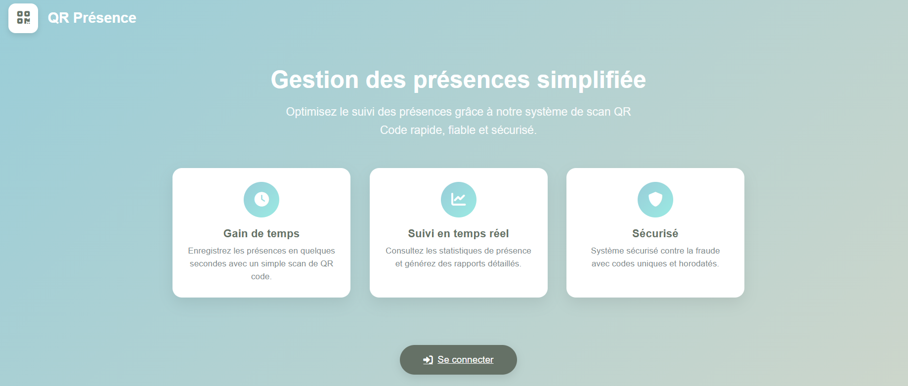
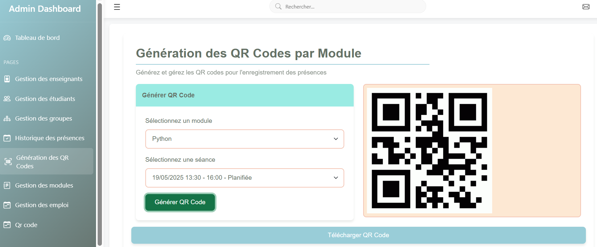
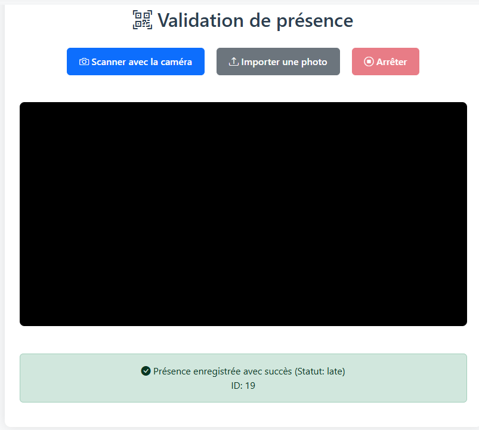
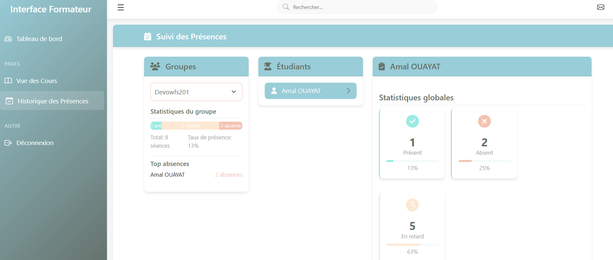

# 📚 QR Attendance – Application de gestion des présences avec QR Code

## 📝 Description
Ce projet consiste en la réalisation d'une **application web de gestion des présences** utilisant la technologie **QR Code**.  
L'objectif principal est **d'automatiser le pointage des présences** pour le rendre plus rapide, fiable et sécurisé.

---

## ❌ Problématique
- Perte de temps en classe pour prendre les présences  
- Risque d'erreurs ou de fraudes  
- Difficulté à garder un historique clair et organisé  

➡️ Il est donc nécessaire d’automatiser ce processus à l’aide d’une application web intelligente.

---

## 📊 Objectifs du Projet
- Automatiser l'enregistrement des présences via QR Code  
- Centraliser les données dans une base MySQL  
- Permettre l'export des présences en Excel  
- Offrir des interfaces adaptées à chaque profil utilisateur  
- Faciliter le partage de ressources pédagogiques  

---

## 🛠️ Technologies Utilisées
- **Front-end :** HTML5, CSS3, JavaScript (Fetch API)  
- **Back-end :** PHP  
- **Base de données :** MySQL (phpMyAdmin)  
- **Serveur :** Apache (XAMPP/WAMP)  
- **QR Code :** Librairie JavaScript pour génération/lecture  
- **Export Excel :** PhpSpreadsheet  
- **IDE :** Visual Studio Code  

---

## 👥 Fonctionnalités par profil

### 🔑 Administrateur
- Tableau de bord  
- Gestion des enseignants  
- Gestion des étudiants  
- Gestion des groupes  
- Gestion des modules  
- Gestion des emplois du temps  
- Génération des QR Codes  
- Historique des présences  
- Déconnexion  

### 👨‍🏫 Formateur
- Tableau de bord  
- Vue des cours  
- Historique des présences  
- Déconnexion  

### 🎓 Étudiant
- Tableau de bord  
- Scanner un QR Code pour valider la présence  
- Historique des présences  
- Déconnexion  

---

## 📂 Installation
1. Cloner le projet :
   ```bash
   git clone https://github.com/AmalOuayat/qr-attendance.git
   ```
2. Placer le dossier dans `htdocs` (XAMPP) ou `www` (WAMP).  
3. Créer une base de données dans phpMyAdmin et importer `database.sql`.  
4. Configurer `config.php` avec vos identifiants MySQL.  
5. Lancer Apache et MySQL depuis XAMPP/WAMP.  
6. Accéder à l’application via :
   ```
   http://localhost/qr-attendance
   ```

---

## 🖼️ Captures d’écran

### 1️⃣ Page de connexion


### 2️⃣ Tableau de bord administrateur


### 3️⃣ Scanner un QR Code


### 4️⃣ Statistiques


---

## 👤 Auteur
Projet développé par **Amal Ouayat**  
📧 Contact : [ouayatamal@gmail.com](mailto:ouayatamal@gmail.com)  


---

